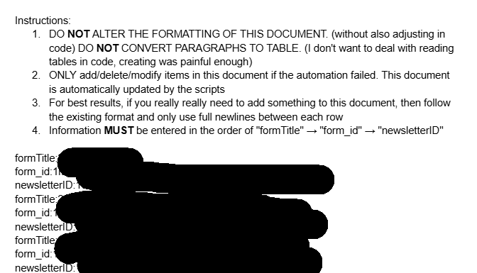
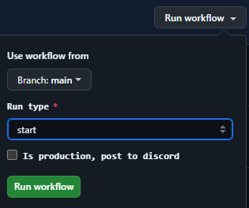

# Fredderloop

Fredderloop is a basic reimagined version of Letterloop helps individuals update each other in monthly issues with all the spicy tea and pics from the previous month. This is implemented using service accounts to keep everyone in suspense (no sneak peeks at responses), but can all be set up to execute as the user account.

## Architecture

* Scheduled python scripts running periodically with cron scheduled triggers in Github Actions
* Google Service Account creating and managing forms/responses so that users can not edit/view them easily

### Core Files

create_form.py

- runs at the on the 1st of every month
- creates a google form with a sharable link in a specified folder
- toggle setting to allow users to edit their responses after submitting (currently not supported)
- set permissions so that everyone with the link can edit the google form
- send link to discord channel via webhook

collect_responses.py

- runs on the 21st of every month
- changes permission so that form is not editable
- send link to discord channel via webhook

share_responses.py

- runs on the 28th of every month
- create google doc with all responses and photos
  - responses are split per question and then per person
- comments can be added like with a normal google doc
- send link to discord channel via webhook

add_questions_reminder.py

- runs on the 20th of every month
- send discord message to remind that it's last day to submit questions

submission_reminder.py

- runs on the 27th of every month
- send discord message to remind that it's last day to submit responses

last_hour_reminder.py

- runs the last hour of the 27th of every month
- send discord message for last hour reminders to submit responses

### Database

In the current iteration, the database is just a Google Drive docs with each form id stored on separate lines. This is definitely not out of laziness and taking advantage of another piece that's already built and is for simplifying the overall design of the project.

See the below image for an example of what this looks like:



## Setting up Github Actions

1. Add the configs from the config.py file as individual Github Actions secrets (making sure the naming and case matches the workflow)
2. Once you have the service account credentials stored in the file specified in the config, use the following command to get the base64 string you should save into the `SERVICE_ACCOUNT_CREDENTIALS_BASE64` secret.
3. Once you execute `cat <filename> | base64 > <tmp file>`, be sure to remove any newlines created and the entire base64 string should be one line/continuous string. Otherwise Github actions will not recognize the content.
4. Once the secrets are set up, the cron schedule will execute as scheduled as long as the workflow file is on the default branch.
5. The workflows is also set up such that if you can manually trigger the desired workflow and specify if the Discord webhook should be triggered or if the message (file id's + emails masked) should be printed to stdout instead.



## Local Development

This section describes how to get started from scratch.

### Requirements

- python3 >= 3.10.7
- pip
- python3.10-venv
- Google Cloud project
- Google credentials
- Google service account

### Setting up the Google Cloud project/credentials

This [python quickstart guide](https://developers.google.com/forms/api/quickstart/python) can be used as a reference for most of the steps. Deviations or additional steps are noted below

#### API Scopes

Below are the required API scopes for this project.

- Google Forms API - Used to interact with Google Forms
- Google Docs API - Used to create the Newsletter in a Google Doc
- Google Drive API - `https://www.googleapis.com/auth/drive.file`, Create new Drive files, or modify existing files, that you open with an app or that the user shares with an app while using the Google Picker API or the app's file picker.

### config.py

`config.py` should be used to store credentials, but should NEVER be pushed with production secrets.

**Note**: The credentials and tokens do not need to be generated to modify a current setup and instructions are present for creating your own setup.

```text
SERVICE_ACCOUNT_CREDENTIALS=<name of json file containing service account key>
GOOGLE_DRIVE_FOLDER_ID=<last segment of google drive folder url (after last "/") for form location>
NEWSLETTER_FOLDER_ID=<last segment of google drive folder url (after last "/") for newsletter docs location>
DISCORD_LETTERLOOP_WEBHOOK=<discord channel webhook, see below for creating>
DOC_ID_DOCUMENT_ID=<file id of database document>
```

### SERVICE_ACCOUNT_CREDENTIALS

Follow the Google Forms quickstart guide and you can download this json file after adding a key to the service account.

### local environment

Use the following to create and start a virtual environment with the required python libraries installed.

```bash
python3 -m venv .venv
source .venv/bin/activate
pip install -r requirements.txt
```

**Note**: Use `deactivate` to exit out of the virtual environment

### Discord webhook

1. Go to Channel settings\

2. Go to the "Integrations" page\

3. Click on "Webhook"\
4. Click "New Webhook"\

5. Edit name, target channel, image, and copy webhook url\

6. Save the Webhook URL in the `config.py` file

### Google API Documentation

- [Drive v3 API Documentation](https://googleapis.github.io/google-api-python-client/docs/dyn/drive_v3.html)
- [Docs v1 API Documentation](https://googleapis.github.io/google-api-python-client/docs/dyn/docs_v1.html)
- [Forms v1 API Documentation](https://googleapis.github.io/google-api-python-client/docs/dyn/forms_v1.html)
